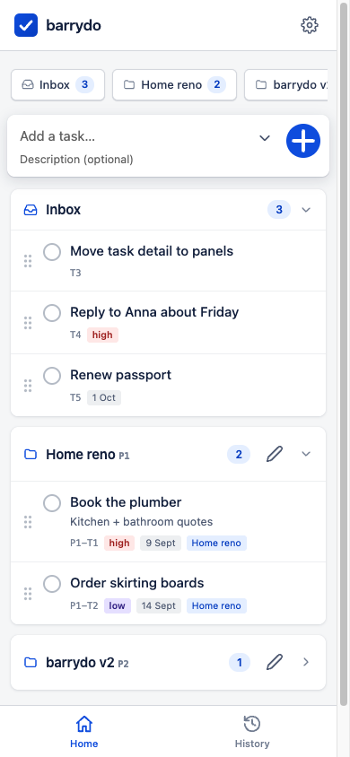

# barrydo



A single-user task manager you own end-to-end: a mobile-first PWA for yourself,
plus an [MCP](https://modelcontextprotocol.io) server so your AI agents and chat tools can
create, read, and manage your tasks and projects directly.

One Cloudflare Worker serves everything — the PWA, the REST API, and the MCP endpoint —
backed by one D1 SQLite database. One API key is the only auth (it's just you).
Runs entirely on Cloudflare's **free tier**.

```
        ┌────────────────────────────────────────────┐
        │  Cloudflare Worker (free tier)             │
        │  ├── /            PWA (installable)        │
        │  ├── /api/*       REST (used by the PWA)   │
        │  └── /mcp         MCP server (14 tools)    │
        │        └── D1 SQLite (tasks, projects)     │
        └────────────────────────────────────────────┘
             ▲                    ▲
        your phone/desktop     your agents (an MCP client,
        (PWA, key = login)     a chat client, any MCP client)
```

## Features

- **Tasks**: title + description, High/Medium/Low/None priority, date-only due dates, stable
  numbered refs (`T12` in inbox, `P3-T12` inside project 3) that are never reused
- **Projects**: create/edit/delete; deleting a project moves its tasks to the inbox
- **Home page**: everything on one page — inbox + every project as an accordion group,
  collapsible with state remembered per device, 2-tab nav (Home / History); tap a group
  header to add a task to that group; fuzzy search (tasks + projects) filters live as you type
- **Drag & drop** (touch-capable): reorder tasks and projects, drag tasks between groups;
  dragging over a collapsed group expands it live.
  Project names must be unique (case-insensitive) — duplicates are rejected
- **Optimistic UI**: task creation and completion render *instantly* — no waiting on the
  network, no accidental double-creates
- **History**: soft delete only — completed and deleted tasks are kept forever with status
  and timestamps, restorable with one tap
- **MCP**: all 14 operations exposed as tools (streamable HTTP, stateless) — wire it into
  any MCP client with a URL + bearer header; connection details with copy buttons live in
  the app under Settings → MCP
- **Single key auth**: one `API_KEY` secret gates the PWA, REST, and MCP. No accounts.
- **Light**: vanilla JS/CSS (Atlassian-flavoured design tokens), no framework, no build step

## Quick start (one script)

Prerequisites: a free [Cloudflare account](https://dash.cloudflare.com/sign-up),
Node 18+ (v20+ recommended), npm, and `git`.

```bash
git clone https://github.com/kingfisherfox/barrydo && cd barrydo
npm install
./setup.sh
```

`setup.sh` will:

1. Open Cloudflare login in your browser (if not already logged in)
2. Ask for a worker name (default `barrydo`; pick anything unique to you)
3. Create the D1 database and wire its id into `wrangler.jsonc`
4. Apply database migrations
5. Generate a strong API key and store it as a Worker secret
6. Deploy, then print **your URL, your API key, and a ready-to-paste MCP config**

Save the printed key — **it is your password for the web app** and your agents'
credential in one. It is not shown anywhere else at setup time, cannot be changed
inside the app, and cannot be recovered if lost (you'd generate a new one — see below).

## Your API key is your password

The single `API_KEY` secret does double duty:

- **Web app login**: opening the PWA asks for the key once per device — that *is* the
  login screen (no usernames, no registration, it's just you)
- **Agents / API clients**: the same value in the `Authorization: Bearer …` header for
  MCP and REST

Because it's stored as a Cloudflare Worker secret, it is **never editable from inside
the app** — by design. Inside the app you can *view* it (Settings → MCP, to copy when
wiring a new tool), but changing it is a CLI operation.

## Changing / rotating the key

No redeploy is needed — a secret update takes effect immediately:

```bash
openssl rand -base64 32 | tr -d '/+=' | head -c 40   # or any strong string
npx wrangler secret put API_KEY                       # paste the new key
```

After rotating: the old key stops working instantly. Re-enter the new key in the PWA
(Settings → Account → Sign out, then unlock), and update the header in any connected
agents. Nothing else changes — tasks and history are untouched.

**Lost the key?** Same command — rotate to a new one and log back in.

## Manual setup (if you prefer)

```bash
npm install
npx wrangler login                                  # browser auth
cp wrangler.template.jsonc wrangler.jsonc           # your local config (gitignored)
npx wrangler d1 create barrydo                      # note the database_id
# put that id into wrangler.jsonc → d1_databases[0].database_id
npx wrangler d1 migrations apply barrydo --remote   # create tables
openssl rand -base64 32 | tr -d '/+=' | head -c 40  # generate your API key
echo "YOUR_KEY" | npx wrangler secret put API_KEY
npx wrangler deploy                                 # → https://<name>.<subdomain>.workers.dev
```

### Use it

1. Open the deployed URL, enter your API key — that's the whole login
2. Install as an app: iOS Share → *Add to Home Screen*; Android/desktop → install prompt
3. Wire agents: Settings → MCP inside the app shows the endpoint, the
   `Authorization: Bearer …` header, and a copy-ready JSON config for MCP clients

## Local development

```bash
echo "API_KEY=anything-local" > .dev.vars
npm run migrate:local   # local D1
npm run dev             # http://localhost:8787
npm run types           # tsc --noEmit
```

`.dev.vars` is gitignored — put a throwaway key in it, never your production one.

## Costs

Free tier, comfortably: Workers free = 100k requests/day, D1 free = 5M row reads /
100k row writes per day, Workers Assets = free. A personal todo list uses a rounding
error of these budgets. No paid plan needed.

## Security model

- One shared secret (`API_KEY`): your web-app login *and* your agents' bearer token —
  constant-time-compared (SHA-256 digests) on every `/api/*` and `/mcp` request
- The key lives only in Cloudflare's secret store (and wherever you save it); it is
  not editable in-app, only rotatable via the CLI
- HTTPS everywhere (workers.dev), CORS on `/mcp` for browser-based MCP clients
- No user accounts, no PII, no telemetry; soft deletes only — your history is yours
- The repo contains no secrets and no account-specific config: keys live in
  Cloudflare's secret store, and `wrangler.jsonc` (your deployment ids) is generated
  from the tracked `wrangler.template.jsonc` and gitignored

## Docs

- [`docs/api-surface.md`](docs/api-surface.md) — REST endpoints + all 14 MCP tools and ref conventions
- [`docs/schema.md`](docs/schema.md) — D1 schema and invariants
- [`docs/CODE_INDEX.md`](docs/CODE_INDEX.md) — repository map
- `.pi/` — agent rules, constraints, and architecture decision records

## License

MIT — see [LICENSE](LICENSE).
